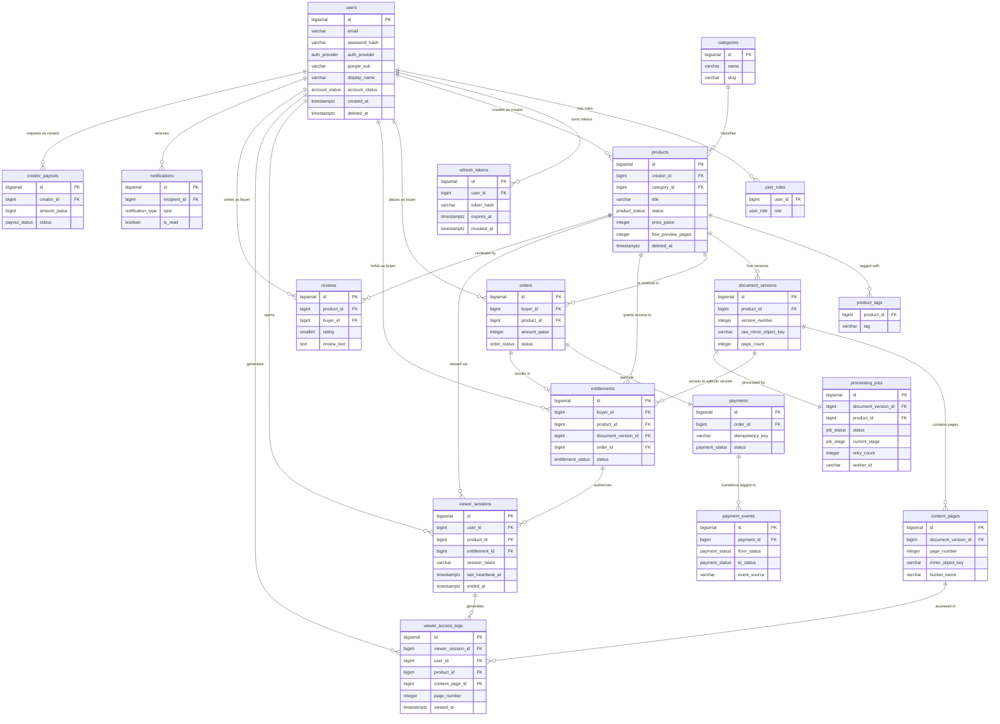

# SecureLeaf — PostgreSQL Database Schema

> **Status**: Phase 0 Deliverable — Finalized data model before any backend code is written.  
> **Database**: PostgreSQL 16  
> **Conventions**: `snake_case` names, `BIGSERIAL` surrogate PKs, `TIMESTAMPTZ` for all timestamps, soft deletes via `deleted_at`.

---

## Table of Contents

1. [ENUM Types](#enum-types)
2. [Identity & Access](#1-identity--access)
3. [Product & Content Lifecycle](#2-product--content-lifecycle)
4. [Commerce & Entitlements](#3-commerce--entitlements)
5. [DRM Viewer & Audit](#4-drm-viewer--audit)
6. [Async Processing](#5-async-processing)
7. [Engagement & Payouts](#6-engagement--payouts)
8. [Index Summary](#index-summary)
9. [ER Diagram](#er-diagram)
10. [Design Notes & Validations](#design-notes--validations)

---

## ENUM Types

Define all enums first — they are referenced by multiple tables.

```sql
-- User authentication provider
CREATE TYPE auth_provider AS ENUM (
    'LOCAL',    -- email + password registration
    'GOOGLE'    -- Google OAuth2
);

-- User account status
CREATE TYPE account_status AS ENUM (
    'ACTIVE',
    'SUSPENDED',
    'DEACTIVATED'
);

-- All assignable roles (multi-role per user via user_roles join table)
CREATE TYPE user_role AS ENUM (
    'BUYER',
    'CREATOR',
    'ADMIN'
);

-- Product lifecycle status
CREATE TYPE product_status AS ENUM (
    'DRAFT',        -- created but not yet submitted for processing
    'PROCESSING',   -- processing_jobs pipeline running
    'LIVE',         -- published and visible on marketplace
    'UNPUBLISHED',  -- creator manually unpublished (soft hide)
    'FAILED'        -- processing pipeline failed after max retries
);

-- Processing pipeline job status
CREATE TYPE job_status AS ENUM (
    'QUEUED',
    'PROCESSING',
    'COMPLETED',
    'FAILED'
);

-- Processing pipeline stages (state machine transitions)
CREATE TYPE job_stage AS ENUM (
    'VALIDATE',           -- validate file type and integrity
    'CONVERT_TILES',      -- PDF pages to image tiles via PDFBox
    'GENERATE_THUMBNAIL',
    'GENERATE_PREVIEW',   -- blurred preview pages
    'MARK_LIVE'
);

-- Order status
CREATE TYPE order_status AS ENUM (
    'PENDING',    -- buyer initiated checkout
    'COMPLETED',  -- payment succeeded, entitlement granted
    'FAILED',     -- payment failed
    'REFUNDED'
);

-- Payment status (mirrors payment provider states)
CREATE TYPE payment_status AS ENUM (
    'PENDING',
    'COMPLETED',
    'FAILED',
    'REFUNDED'
);

-- Entitlement access status
CREATE TYPE entitlement_status AS ENUM (
    'ACTIVE',
    'REVOKED',   -- admin revocation
    'EXPIRED'    -- future subscription model
);

-- Payout request status
CREATE TYPE payout_status AS ENUM (
    'REQUESTED',
    'APPROVED',
    'PROCESSING',
    'PAID',
    'REJECTED'
);

-- Notification type
CREATE TYPE notification_type AS ENUM (
    'PURCHASE_SUCCESS',     -- buyer: you bought a product
    'SALE_RECEIVED',        -- creator: someone bought your product
    'PROCESSING_COMPLETE',  -- creator: your upload is now LIVE
    'PROCESSING_FAILED',    -- creator: your upload failed
    'PAYOUT_STATUS_UPDATE'  -- creator: payout status changed
);
```

---

## 1. Identity & Access

### `users`

Single unified user table. A user can hold multiple roles (BUYER, CREATOR, ADMIN) via the `user_roles` join table. Supports both `LOCAL` (email/password) and `GOOGLE` OAuth2 authentication.

```sql
CREATE TABLE users (
    id                     BIGSERIAL      PRIMARY KEY,
    email                  VARCHAR(255)   NOT NULL,
    password_hash          VARCHAR(255),                           -- NULL for GOOGLE-only accounts
    auth_provider          auth_provider  NOT NULL DEFAULT 'LOCAL',
    google_sub             VARCHAR(255),                           -- Google OAuth2 subject ID; NULL for LOCAL accounts
    display_name           VARCHAR(100)   NOT NULL,
    bio                    TEXT,                                   -- Creator bio; optional for buyers
    avatar_url             VARCHAR(500),
    account_status         account_status NOT NULL DEFAULT 'ACTIVE',

    -- Creator-specific payout details (nullable for Buyer-only accounts)
    payout_email           VARCHAR(255),                           -- email for payout transfers
    payout_upi             VARCHAR(100),                           -- UPI ID (India)

    -- Password reset support (AUTH-07)
    reset_token_hash       VARCHAR(255),                           -- hashed one-time reset token
    reset_token_expires_at TIMESTAMPTZ,

    created_at             TIMESTAMPTZ    NOT NULL DEFAULT NOW(),
    updated_at             TIMESTAMPTZ    NOT NULL DEFAULT NOW(),
    deleted_at             TIMESTAMPTZ,                            -- soft delete / account deactivation

    CONSTRAINT uq_users_email           UNIQUE (email),
    CONSTRAINT uq_users_google_sub      UNIQUE (google_sub),
    CONSTRAINT chk_users_local_has_pwd  CHECK (
        auth_provider != 'LOCAL' OR password_hash IS NOT NULL
    ),
    CONSTRAINT chk_users_google_has_sub CHECK (
        auth_provider != 'GOOGLE' OR google_sub IS NOT NULL
    )
);

CREATE INDEX idx_users_email          ON users (email);
CREATE INDEX idx_users_google_sub     ON users (google_sub)       WHERE google_sub IS NOT NULL;
CREATE INDEX idx_users_account_status ON users (account_status);
CREATE INDEX idx_users_deleted_at     ON users (deleted_at)       WHERE deleted_at IS NOT NULL;
```

**Key Decisions:**
- `password_hash` is `NULL` for Google OAuth2 users — enforced by the CHECK constraint.
- `google_sub` (Google's stable user identifier) is stored for OAuth2 account linking.
- Single table for all roles; roles are assigned via the `user_roles` join table.
- Soft delete via `deleted_at` supports AUTH-08 admin suspension.

---

### `user_roles`

Many-to-many assignment of roles to users. One user can be both BUYER and CREATOR simultaneously.

```sql
CREATE TABLE user_roles (
    user_id     BIGINT    NOT NULL REFERENCES users (id) ON DELETE CASCADE,
    role        user_role NOT NULL,
    assigned_at TIMESTAMPTZ NOT NULL DEFAULT NOW(),

    PRIMARY KEY (user_id, role)
);

CREATE INDEX idx_user_roles_user_id ON user_roles (user_id);
```

---

### `refresh_tokens`

Hashed refresh tokens for JWT rotation (AUTH-03/04). Old tokens are invalidated on use. Supports multi-device login.

```sql
CREATE TABLE refresh_tokens (
    id             BIGSERIAL    PRIMARY KEY,
    user_id        BIGINT       NOT NULL REFERENCES users (id) ON DELETE CASCADE,
    token_hash     VARCHAR(255) NOT NULL,                   -- SHA-256 hash; raw token never stored
    device_hint    VARCHAR(255),                            -- optional: browser/OS hint for UI display
    issued_at      TIMESTAMPTZ  NOT NULL DEFAULT NOW(),
    expires_at     TIMESTAMPTZ  NOT NULL,
    revoked_at     TIMESTAMPTZ,                             -- set on rotation or logout
    replaced_by_id BIGINT       REFERENCES refresh_tokens (id), -- token chain for rotation audit

    CONSTRAINT uq_refresh_tokens_hash UNIQUE (token_hash)
);

CREATE INDEX idx_refresh_tokens_user_id    ON refresh_tokens (user_id);
CREATE INDEX idx_refresh_tokens_token_hash ON refresh_tokens (token_hash);
CREATE INDEX idx_refresh_tokens_expires_at ON refresh_tokens (expires_at);
```

**Key Decisions:**
- `token_hash` only — raw refresh tokens are never persisted (security best practice).
- `revoked_at` enables immediate invalidation without deleting the audit trail.
- `replaced_by_id` creates a rotation chain for security auditing.

---

## 2. Product & Content Lifecycle

### `categories`

Master table for product categories. Seeded at startup.

```sql
CREATE TABLE categories (
    id          BIGSERIAL    PRIMARY KEY,
    name        VARCHAR(100) NOT NULL,
    slug        VARCHAR(100) NOT NULL,    -- URL-safe identifier, e.g. "data-science"
    description TEXT,
    created_at  TIMESTAMPTZ  NOT NULL DEFAULT NOW(),

    CONSTRAINT uq_categories_name UNIQUE (name),
    CONSTRAINT uq_categories_slug UNIQUE (slug)
);
```

---

### `products`

Core marketplace listing. Each product is owned by one creator. Soft delete via `deleted_at` ensures existing buyers never lose access (UPLOAD-09, Reliability NFR).

```sql
CREATE TABLE products (
    id                 BIGSERIAL      PRIMARY KEY,
    creator_id         BIGINT         NOT NULL REFERENCES users (id),
    category_id        BIGINT         NOT NULL REFERENCES categories (id),

    title              VARCHAR(255)   NOT NULL,
    slug               VARCHAR(300)   NOT NULL,   -- URL slug, e.g. "advanced-sql-mastery"
    description        TEXT           NOT NULL,
    cover_image_url    VARCHAR(500),

    -- Pricing (UPLOAD-06, UPLOAD-07)
    -- Stored in smallest currency unit (paise for INR); 0 = FREE
    price_paise        INTEGER        NOT NULL DEFAULT 0 CHECK (price_paise >= 0),

    -- Free preview configuration (UPLOAD-08, MARKET-06)
    free_preview_pages INTEGER        NOT NULL DEFAULT 3 CHECK (free_preview_pages >= 0),

    -- Lifecycle status
    status             product_status NOT NULL DEFAULT 'DRAFT',

    -- Denormalized stats (updated by service layer, not DB triggers)
    total_sales        INTEGER        NOT NULL DEFAULT 0 CHECK (total_sales >= 0),
    average_rating     NUMERIC(3,2)   CHECK (average_rating BETWEEN 1.00 AND 5.00),
    review_count       INTEGER        NOT NULL DEFAULT 0 CHECK (review_count >= 0),

    created_at         TIMESTAMPTZ    NOT NULL DEFAULT NOW(),
    updated_at         TIMESTAMPTZ    NOT NULL DEFAULT NOW(),
    deleted_at         TIMESTAMPTZ,   -- soft delete: product hidden, buyer entitlements remain intact

    CONSTRAINT uq_products_slug UNIQUE (slug)
);

CREATE INDEX idx_products_creator_id  ON products (creator_id);
CREATE INDEX idx_products_category_id ON products (category_id);
CREATE INDEX idx_products_status      ON products (status);
CREATE INDEX idx_products_deleted_at  ON products (deleted_at) WHERE deleted_at IS NOT NULL;

-- Partial index for marketplace listing: LIVE + not deleted, sorted newest first
CREATE INDEX idx_products_live_listing
    ON products (status, created_at DESC)
    WHERE status = 'LIVE' AND deleted_at IS NULL;

-- Full-text search on title + description (MARKET-02)
CREATE INDEX idx_products_fts
    ON products USING GIN (to_tsvector('english', title || ' ' || description));
```

**Key Decisions:**
- `price_paise` stores price as an integer in the smallest currency unit — avoids floating-point rounding errors.
- `average_rating` and `total_sales` are denormalized for fast marketplace queries; updated by service layer on review/purchase events.
- Soft delete ensures entitlements pointing to this product remain valid.

---

### `product_tags`

Many-to-many tags for search and filtering (MARKET-02).

```sql
CREATE TABLE product_tags (
    product_id BIGINT      NOT NULL REFERENCES products (id) ON DELETE CASCADE,
    tag        VARCHAR(50) NOT NULL CHECK (tag = LOWER(TRIM(tag))), -- enforce lowercase, trimmed

    PRIMARY KEY (product_id, tag)
);

CREATE INDEX idx_product_tags_tag        ON product_tags (tag);
CREATE INDEX idx_product_tags_product_id ON product_tags (product_id);
```

---

### `document_versions`

Versioned uploads per product. MVP assumes one active version per product, but the schema supports multi-version for MVP 2.

```sql
CREATE TABLE document_versions (
    id                   BIGSERIAL    PRIMARY KEY,
    product_id           BIGINT       NOT NULL REFERENCES products (id) ON DELETE CASCADE,
    version_number       INTEGER      NOT NULL DEFAULT 1 CHECK (version_number >= 1),

    -- Original upload metadata
    original_filename    VARCHAR(255) NOT NULL,
    file_size_bytes      BIGINT       NOT NULL CHECK (file_size_bytes > 0),
    mime_type            VARCHAR(100) NOT NULL DEFAULT 'application/pdf',

    -- MinIO storage of the raw (clean) source file
    raw_minio_bucket     VARCHAR(100) NOT NULL,
    raw_minio_object_key VARCHAR(500) NOT NULL,

    -- Derived content (set after pipeline stages complete)
    page_count           INTEGER      CHECK (page_count > 0),
    thumbnail_minio_key  VARCHAR(500),

    created_at           TIMESTAMPTZ  NOT NULL DEFAULT NOW(),
    processed_at         TIMESTAMPTZ,                         -- set when MARK_LIVE stage completes

    CONSTRAINT uq_document_versions_product_version UNIQUE (product_id, version_number)
);

CREATE INDEX idx_document_versions_product_id ON document_versions (product_id);
```

---

### `content_pages`

Individual image tile records per document version. Each row represents one rendered page tile stored in MinIO. This is the source of truth for the secure viewer's tile-serving logic.

```sql
CREATE TABLE content_pages (
    id                  BIGSERIAL    PRIMARY KEY,
    document_version_id BIGINT       NOT NULL REFERENCES document_versions (id) ON DELETE CASCADE,
    page_number         INTEGER      NOT NULL CHECK (page_number >= 1),

    -- MinIO location of the CLEAN tile (buyer never receives this directly)
    bucket_name         VARCHAR(100) NOT NULL,
    minio_object_key    VARCHAR(500) NOT NULL,

    -- Tile metadata
    width_px            INTEGER      CHECK (width_px > 0),
    height_px           INTEGER      CHECK (height_px > 0),
    file_size_bytes     BIGINT       CHECK (file_size_bytes > 0),

    created_at          TIMESTAMPTZ  NOT NULL DEFAULT NOW(),

    CONSTRAINT uq_content_pages_version_page UNIQUE (document_version_id, page_number)
);

CREATE INDEX idx_content_pages_document_version_id ON content_pages (document_version_id);
-- Viewer page navigation: fetch tile by version + page number
CREATE INDEX idx_content_pages_version_page ON content_pages (document_version_id, page_number);
```

**Key Decision:** Stores the **clean** tile path. The watermark is burned server-side per request at tile-serve time — the clean tile in MinIO is never sent directly to any client (Security NFR).

---

## 3. Commerce & Entitlements

### `orders`

Purchase intent record. Created when the buyer clicks "Buy Now", before payment is confirmed.

```sql
CREATE TABLE orders (
    id           BIGSERIAL    PRIMARY KEY,
    buyer_id     BIGINT       NOT NULL REFERENCES users (id),
    product_id   BIGINT       NOT NULL REFERENCES products (id),

    -- Amount captured at moment of purchase (price can change after)
    amount_paise INTEGER      NOT NULL CHECK (amount_paise >= 0),

    status       order_status NOT NULL DEFAULT 'PENDING',

    created_at   TIMESTAMPTZ  NOT NULL DEFAULT NOW(),
    updated_at   TIMESTAMPTZ  NOT NULL DEFAULT NOW()
);

CREATE INDEX idx_orders_buyer_id   ON orders (buyer_id);
CREATE INDEX idx_orders_product_id ON orders (product_id);
CREATE INDEX idx_orders_status     ON orders (status);
```

---

### `payments`

Payment execution record. Linked 1-to-1 with an order. Contains the idempotency key to prevent duplicate charges (PAY-04, PAY-07).

```sql
CREATE TABLE payments (
    id                   BIGSERIAL      PRIMARY KEY,
    order_id             BIGINT         NOT NULL REFERENCES orders (id),

    idempotency_key      VARCHAR(255)   NOT NULL,   -- UUID v4, generated by our system before calling provider
    provider_payment_id  VARCHAR(255),               -- external ID from mock/Stripe/Razorpay
    provider_name        VARCHAR(50)    NOT NULL DEFAULT 'MOCK',

    amount_paise         INTEGER        NOT NULL CHECK (amount_paise >= 0),
    status               payment_status NOT NULL DEFAULT 'PENDING',

    created_at           TIMESTAMPTZ    NOT NULL DEFAULT NOW(),
    updated_at           TIMESTAMPTZ    NOT NULL DEFAULT NOW(),

    CONSTRAINT uq_payments_order_id        UNIQUE (order_id),         -- 1-to-1 with order
    CONSTRAINT uq_payments_idempotency_key UNIQUE (idempotency_key)   -- prevent duplicate charges
);

CREATE INDEX idx_payments_order_id            ON payments (order_id);
CREATE INDEX idx_payments_idempotency_key     ON payments (idempotency_key);
CREATE INDEX idx_payments_provider_payment_id ON payments (provider_payment_id)
    WHERE provider_payment_id IS NOT NULL;
```

---

### `payment_events`

Immutable append-only audit log of every payment state transition (PAY-06). Never updated, only inserted. Critical for idempotent webhook processing (PAY-07).

```sql
CREATE TABLE payment_events (
    id                BIGSERIAL      PRIMARY KEY,
    payment_id        BIGINT         NOT NULL REFERENCES payments (id),

    from_status       payment_status,                 -- NULL for first event
    to_status         payment_status NOT NULL,

    event_source      VARCHAR(100)   NOT NULL,        -- e.g. 'WEBHOOK', 'SYSTEM', 'ADMIN'
    provider_event_id VARCHAR(255),                   -- external webhook event ID (for dedup)
    raw_payload       JSONB,                          -- full provider webhook payload

    occurred_at       TIMESTAMPTZ    NOT NULL DEFAULT NOW(),

    -- Prevent replaying the same provider webhook event
    CONSTRAINT uq_payment_events_provider_event UNIQUE (provider_event_id)
);

CREATE INDEX idx_payment_events_payment_id     ON payment_events (payment_id);
CREATE INDEX idx_payment_events_provider_event ON payment_events (provider_event_id)
    WHERE provider_event_id IS NOT NULL;
```

---

### `entitlements`

The actual access grant. Created when payment succeeds. This is what the viewer checks — not the order or payment. Links a buyer to a specific `document_version`.

```sql
CREATE TABLE entitlements (
    id                  BIGSERIAL          PRIMARY KEY,
    buyer_id            BIGINT             NOT NULL REFERENCES users (id),
    product_id          BIGINT             NOT NULL REFERENCES products (id),
    document_version_id BIGINT             NOT NULL REFERENCES document_versions (id),
    order_id            BIGINT             NOT NULL REFERENCES orders (id),

    status              entitlement_status NOT NULL DEFAULT 'ACTIVE',
    granted_at          TIMESTAMPTZ        NOT NULL DEFAULT NOW(),
    revoked_at          TIMESTAMPTZ,
    revocation_reason   TEXT,

    -- One entitlement per buyer per product (prevents duplicate access grants)
    CONSTRAINT uq_entitlements_buyer_product UNIQUE (buyer_id, product_id)
);

CREATE INDEX idx_entitlements_buyer_id            ON entitlements (buyer_id);
CREATE INDEX idx_entitlements_product_id          ON entitlements (product_id);
CREATE INDEX idx_entitlements_document_version_id ON entitlements (document_version_id);
CREATE INDEX idx_entitlements_order_id            ON entitlements (order_id);

-- Viewer auth check: buyer + product -> active entitlement (partial index, hot path)
CREATE INDEX idx_entitlements_buyer_product_active
    ON entitlements (buyer_id, product_id)
    WHERE status = 'ACTIVE';
```

**Key Decisions:**
- The UNIQUE constraint on `(buyer_id, product_id)` is the application-level idempotency guard — even if duplicate payment events slip through, only one entitlement can exist per buyer per product.
- Linking to `document_version_id` future-proofs versioned access (MVP 2).

---

## 4. DRM Viewer & Audit

### `viewer_sessions`

Active viewing sessions. Used for single-session enforcement (VIEW-10). The `session_token` is checked against Redis for the active session lock.

```sql
CREATE TABLE viewer_sessions (
    id                 BIGSERIAL    PRIMARY KEY,
    user_id            BIGINT       NOT NULL REFERENCES users (id) ON DELETE CASCADE,
    product_id         BIGINT       NOT NULL REFERENCES products (id),
    entitlement_id     BIGINT       NOT NULL REFERENCES entitlements (id),

    session_token      VARCHAR(255) NOT NULL,   -- random token stored in Redis; used to invalidate stale sessions
    device_fingerprint VARCHAR(255),            -- browser fingerprint (User-Agent hash + screen res)
    ip_address         INET,                    -- PostgreSQL native IP type

    started_at         TIMESTAMPTZ  NOT NULL DEFAULT NOW(),
    last_heartbeat_at  TIMESTAMPTZ  NOT NULL DEFAULT NOW(), -- updated by client heartbeat every 30s
    ended_at           TIMESTAMPTZ,             -- set when session is invalidated

    CONSTRAINT uq_viewer_sessions_token UNIQUE (session_token)
);

CREATE INDEX idx_viewer_sessions_user_product ON viewer_sessions (user_id, product_id);
CREATE INDEX idx_viewer_sessions_last_heartbeat ON viewer_sessions (last_heartbeat_at);
-- Active session lookup for single-session enforcement
CREATE INDEX idx_viewer_sessions_active
    ON viewer_sessions (user_id, product_id)
    WHERE ended_at IS NULL;
```

**Key Decisions:**
- Single-session enforcement is primarily enforced via Redis `SET NX` (fast, atomic). This table is the durable audit log and fallback recovery source if Redis restarts.
- `last_heartbeat_at` enables stale session cleanup (no heartbeat for 2 minutes = dead session).

---

### `viewer_access_logs`

Immutable audit trail. Every individual page view is logged here (VIEW-13). Never updated, only inserted. Used for DRM compliance and future analytics.

```sql
CREATE TABLE viewer_access_logs (
    id                  BIGSERIAL    PRIMARY KEY,
    viewer_session_id   BIGINT       NOT NULL REFERENCES viewer_sessions (id),
    user_id             BIGINT       NOT NULL REFERENCES users (id),
    product_id          BIGINT       NOT NULL REFERENCES products (id),
    document_version_id BIGINT       NOT NULL REFERENCES document_versions (id),
    content_page_id     BIGINT       NOT NULL REFERENCES content_pages (id),

    page_number         INTEGER      NOT NULL CHECK (page_number >= 1),
    ip_address          INET,
    user_agent          TEXT,
    correlation_id      VARCHAR(100),  -- distributed tracing correlation ID

    viewed_at           TIMESTAMPTZ  NOT NULL DEFAULT NOW()
);

CREATE INDEX idx_viewer_access_logs_user_id    ON viewer_access_logs (user_id);
CREATE INDEX idx_viewer_access_logs_product_id ON viewer_access_logs (product_id);
CREATE INDEX idx_viewer_access_logs_session_id ON viewer_access_logs (viewer_session_id);
CREATE INDEX idx_viewer_access_logs_viewed_at  ON viewer_access_logs (viewed_at);
```

---

## 5. Async Processing

### `processing_jobs`

PostgreSQL-backed durable job queue (replaces Kafka for MVP). Tracks the full upload processing state machine per document version.

```sql
CREATE TABLE processing_jobs (
    id                  BIGSERIAL    PRIMARY KEY,
    document_version_id BIGINT       NOT NULL REFERENCES document_versions (id) ON DELETE CASCADE,
    product_id          BIGINT       NOT NULL REFERENCES products (id),  -- denormalized for fast creator dashboard queries

    status              job_status   NOT NULL DEFAULT 'QUEUED',
    current_stage       job_stage,                                        -- active pipeline stage

    -- Retry tracking (Reliability NFR: retry up to 3x)
    retry_count         INTEGER      NOT NULL DEFAULT 0 CHECK (retry_count >= 0),
    max_retries         INTEGER      NOT NULL DEFAULT 3,
    failure_reason      TEXT,                                             -- last error message on failure

    -- Claim token to prevent two workers processing the same job
    worker_id           VARCHAR(100),           -- Spring instance ID that claimed this job
    claimed_at          TIMESTAMPTZ,

    queued_at           TIMESTAMPTZ  NOT NULL DEFAULT NOW(),
    started_at          TIMESTAMPTZ,
    completed_at        TIMESTAMPTZ,
    updated_at          TIMESTAMPTZ  NOT NULL DEFAULT NOW()
);

-- Worker poll: find QUEUED jobs in FIFO order (used with SELECT FOR UPDATE SKIP LOCKED)
CREATE INDEX idx_processing_jobs_status_queued
    ON processing_jobs (status, queued_at ASC)
    WHERE status = 'QUEUED';

CREATE INDEX idx_processing_jobs_document_version_id ON processing_jobs (document_version_id);
CREATE INDEX idx_processing_jobs_product_id          ON processing_jobs (product_id);
```

**Key Decision:** The worker uses `SELECT ... FOR UPDATE SKIP LOCKED` — a PostgreSQL feature that lets multiple Spring worker threads pick different jobs concurrently without blocking each other. This is the canonical pattern for a Postgres-backed job queue.

---

## 6. Engagement & Payouts

### `reviews`

Buyer ratings and text reviews. One review per buyer per product (REV-03).

```sql
CREATE TABLE reviews (
    id          BIGSERIAL   PRIMARY KEY,
    product_id  BIGINT      NOT NULL REFERENCES products (id) ON DELETE CASCADE,
    buyer_id    BIGINT      NOT NULL REFERENCES users (id),

    rating      SMALLINT    NOT NULL CHECK (rating BETWEEN 1 AND 5),
    review_text TEXT,

    created_at  TIMESTAMPTZ NOT NULL DEFAULT NOW(),
    updated_at  TIMESTAMPTZ NOT NULL DEFAULT NOW(),

    CONSTRAINT uq_reviews_buyer_product UNIQUE (buyer_id, product_id)
);

CREATE INDEX idx_reviews_product_id ON reviews (product_id);
CREATE INDEX idx_reviews_buyer_id   ON reviews (buyer_id);
```

---

### `notifications`

In-app notification records. Delivered via Redis Pub/Sub in real-time; persisted here for the notification inbox.

```sql
CREATE TABLE notifications (
    id                 BIGSERIAL         PRIMARY KEY,
    recipient_id       BIGINT            NOT NULL REFERENCES users (id) ON DELETE CASCADE,

    type               notification_type NOT NULL,
    title              VARCHAR(255)      NOT NULL,
    body               TEXT,

    -- Optional references to related entities
    related_product_id BIGINT            REFERENCES products (id) ON DELETE SET NULL,
    related_order_id   BIGINT            REFERENCES orders (id)   ON DELETE SET NULL,

    is_read            BOOLEAN           NOT NULL DEFAULT FALSE,
    read_at            TIMESTAMPTZ,
    created_at         TIMESTAMPTZ       NOT NULL DEFAULT NOW()
);

CREATE INDEX idx_notifications_recipient_id ON notifications (recipient_id);
-- Notification inbox: unread notifications for a user, newest first
CREATE INDEX idx_notifications_recipient_unread
    ON notifications (recipient_id, created_at DESC)
    WHERE is_read = FALSE;
```

---

### `creator_payouts`

Payout request records with manual approval workflow. Full automation is post-MVP.

```sql
CREATE TABLE creator_payouts (
    id                   BIGSERIAL     PRIMARY KEY,
    creator_id           BIGINT        NOT NULL REFERENCES users (id),

    amount_paise         BIGINT        NOT NULL CHECK (amount_paise > 0),
    status               payout_status NOT NULL DEFAULT 'REQUESTED',

    -- Calculation snapshot at request time
    gross_revenue_paise  BIGINT        NOT NULL,  -- total earnings
    platform_fee_paise   BIGINT        NOT NULL,  -- platform commission (10%)
    net_payout_paise     BIGINT        NOT NULL,  -- gross - fee

    payout_method        VARCHAR(50),             -- 'UPI', 'BANK_TRANSFER', etc.
    payout_reference     VARCHAR(255),            -- transfer reference ID

    requested_at         TIMESTAMPTZ   NOT NULL DEFAULT NOW(),
    processed_at         TIMESTAMPTZ,
    notes                TEXT,                    -- admin notes on rejection/approval
    approved_by          BIGINT        REFERENCES users (id)  -- admin user who approved
);

CREATE INDEX idx_creator_payouts_creator_id ON creator_payouts (creator_id);
CREATE INDEX idx_creator_payouts_status     ON creator_payouts (status);
```

---

## Index Summary

| Table | Index | Purpose |
|-------|-------|---------|
| `users` | `idx_users_email` | Login lookup |
| `users` | `idx_users_google_sub` | OAuth2 account link |
| `users` | `idx_users_account_status` | Admin user filter |
| `refresh_tokens` | `idx_refresh_tokens_token_hash` | Token validation on each refresh |
| `products` | `idx_products_live_listing` | Marketplace listing (partial, hot path) |
| `products` | `idx_products_fts` | Full-text search via GIN |
| `product_tags` | `idx_product_tags_tag` | Tag-based filtering |
| `content_pages` | `idx_content_pages_version_page` | Viewer tile fetch by page number |
| `entitlements` | `idx_entitlements_buyer_product_active` | Viewer auth check (partial, hot path) |
| `viewer_sessions` | `idx_viewer_sessions_active` | Single-session enforcement (partial) |
| `processing_jobs` | `idx_processing_jobs_status_queued` | Worker job poll with SKIP LOCKED (partial) |
| `notifications` | `idx_notifications_recipient_unread` | Notification inbox (partial) |

> **Partial indexes** (e.g., `WHERE status = 'LIVE'`) are significantly smaller and faster than full indexes for status columns where most rows will not be in the queried state.

---

## ER Diagram



---

## Design Notes & Validations

### Requirements Coverage Check

| Requirement | Covered By |
|-------------|-----------|
| AUTH-01 Email/Password | `users.password_hash`, CHECK constraint |
| AUTH-02 Google OAuth2 | `users.auth_provider`, `users.google_sub`, CHECK constraint |
| AUTH-03/04 Refresh token rotation | `refresh_tokens.revoked_at`, `replaced_by_id` |
| AUTH-05 Creator profile | `users.bio`, `users.payout_email` |
| AUTH-07 Password reset | `users.reset_token_hash`, `users.reset_token_expires_at` |
| AUTH-08 Account suspension | `users.account_status` ENUM, `users.deleted_at` |
| UPLOAD-04 Async pipeline | `processing_jobs` table with state machine |
| UPLOAD-08 Free preview pages | `products.free_preview_pages` |
| UPLOAD-09 Soft delete | `products.deleted_at` |
| UPLOAD-10 Retry up to 3x | `processing_jobs.retry_count`, `max_retries` |
| UPLOAD-11 MinIO keys | `document_versions.raw_minio_object_key`, `content_pages.minio_object_key` |
| VIEW-02 Signed URL TTL | Enforced in Redis + service layer; no DB column needed |
| VIEW-03 Server-side watermark | Burned at tile-serve time; no DB column for watermark state |
| VIEW-10 Single session | `viewer_sessions` table + Redis SET NX |
| VIEW-13 Access audit | `viewer_access_logs` immutable table |
| PAY-04 Idempotency key | `payments.idempotency_key` UNIQUE |
| PAY-06 Audit log | `payment_events` append-only table |
| PAY-07 Webhook dedup | `payment_events.provider_event_id` UNIQUE |
| REV-03 One review per buyer | `UNIQUE (buyer_id, product_id)` on `reviews` |
| Reliability: soft delete | `products.deleted_at`; entitlements remain valid |
| Reliability: 3x retry | `processing_jobs.retry_count` + `max_retries = 3` |

### What Is NOT in the Database (Intentionally)

| Concern | Where It Lives | Why |
|---------|---------------|-----|
| Signed tile URL tokens | **Redis** (30s TTL) | Ephemeral; not worth persisting |
| Active viewer session lock | **Redis** SET NX | Requires sub-millisecond atomic lock |
| Real-time pub/sub events | **Redis** Pub/Sub | In-memory, not durable |
| JWT access tokens | **Nowhere** (stateless) | Validated via signature only |

### Key Relationship Validations

- `payments.order_id` is UNIQUE — one payment per order, no double-payment
- `entitlements (buyer_id, product_id)` is UNIQUE — one access grant per buyer per product, regardless of how many payment events arrive
- `reviews (buyer_id, product_id)` is UNIQUE — one review per buyer per product
- CHECK constraints on all `*_paise` columns prevent negative amounts
- `processing_jobs` uses `SELECT FOR UPDATE SKIP LOCKED` for concurrent-safe job claiming by multiple Spring worker threads
